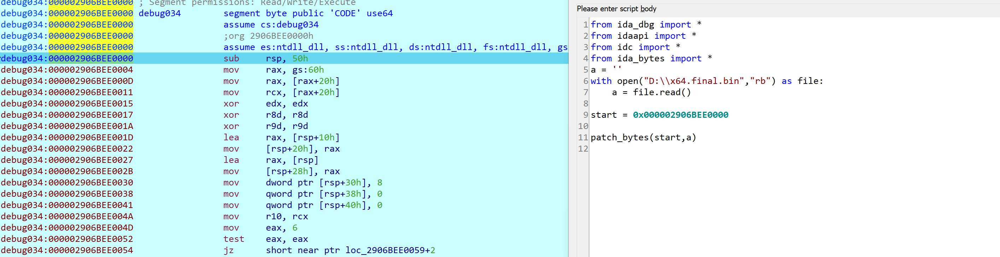

### KMACTF2025

Màn trình diễn đáng thất vọng lần này..., :v tuy vậy về solve được bài heavengate cũng làm mình vui lên chút. Lần trước ngố thì còn có đoạn blame ở đầu chứ lần 2 là do gà chứ đổ cho ai được nữa. Bắt đầu WU thôi.

WU này ngắn gọn thôi, bài nào có kĩ thuật mới thì mình mới trình bày chi tiết.

#### Chal2

Bài này mới nên mình để đầu tiên.

Lần này a Sơn cho mình 1 con binary có sử dụng kỹ thuật heavengate.


Dễ thấy ta cần target vào những địa chỉ `[0x001d4158, 0x001d1017, 0x001d41e2]`

Tất nhiên vì đây sử dụng heaven gate nên mình không thể đọc trong file 32, ở đây mình đã viết thêm 1 file tạo mem x64 rồi dùng idapython load đống mem ở các địa chỉ trên vào.

```C
int __fastcall main(int argc, const char **argv, const char **envp)
{
  void (*v3)(void); // rax
  void (*v4)(void); // rbx

  v3 = (void (*)(void))VirtualAlloc(0LL, 0x30000uLL, 0x3000u, 0x40u);
  v4 = v3;
  if ( v3 )
  {
    *(_BYTE *)v3 = -61;
    v3();
    VirtualFree(v4, 0LL, 0x8000u);
    return 0;
  }
  else
  {
    GetLastError();
    sub_7FF7D0691010("VirtualAlloc failed: %lu\n");
    return 1;
  }
}
```

```python
from ida_dbg import *
from idaapi import *
from idc import *
from ida_bytes import *
a = ''
with open("D:\\x64.final.bin","rb") as file:
    a = file.read()

start = 0x0000019EADF70000

patch_bytes(start,a)
```

Giờ thì debug thôi.


##### Một chút phân tích

Chương trình thì ta có thể chia làm 3 phần, tương ứng với 3 địa chỉ trên:

```
0x001d4158: print message
0x001d1017: check
0x001d41e2: output
```

Tập trung vào phần check, chương trình đọc 8 byte một, và sử dụng 4 byte đầu của input trong quá trình tính toán.
2 byte đầu dùng để giải mã ra vị trí và byte đoạn shell tiếp theo, 2 byte sau xor decrypt nốt nội dung thực sự(như hình dưới thì chúng tương ứng là tại rsp và [rsp +2]).


Rất may rằng chương trình cho payload là KMACTF{xxxxxx} nên khi nhập đoạn đầu vào và nhảy được đến đoạn chương trình thứ 2 thì ta nhận ra được nội dung chúng có chút tương đồng.

Rằng những đoạn sau khả năng sẽ giống nhau khi chỉ đoạn đầu có thêm phần nhập, và luôn có siganture là `mov     rax, gs:60h`, đồng thời khúc giải mã y hệt nhau(khả năng là 1 phần của aes vì thấy các ins như `aesdec` hay `aesdeclast`). Vậy câu chuyện ở đây là brute 4 byte trờ về brute 2 byte đầu tiên, vì ta có thể xor với phần pattern này để kiểm tra 2 byte sau có đúng không.


##### Hướng tiếp cận

Vậy ta có bài toán là brute 2 byte rồi, nhưng brute như nào? thú thực thì mình khá ghét aes(hay bất kì thể loại mã hóa custom nào(như bài simple bên dưới đây)) nên mình không hề muốn code lại chút nào. Mình tất nhiên sẽ loại bỏ phương án reverse khúc mã hóa đầu tiên.

Như vậy thì còn cách tiếp cần nào khác? Mình có thể chỉ ra 2 phương án:

Một là code asm, vì đoạn biến đổi có sẵn rồi nên ta có thể thêm loop vào và custom đoạn đầu thành truyền byte vào `ax` và `bx` để brute. Tuy nhiên phương án này khá nông dân, mình ngay đầu tiên đã nghĩ tới cách này nhưng ngay lập tức loại bỏ vì một số điểm yếu như chưa chắc các đoạn sau đã y hệt, giả sử chúng khác nhau thì ngồi sửa lại còn vất hơn.

Vì thế nên mình đề xuất cách thứ 2 toàn diện và dễ dùng hơn đó là `unicorn emulate`.

Unicorn như nào, đây cũng là lần đầu mình sử dụng nó và thú thực là cực kì dễ dùng. Quay trở lại bài toán, dưới đây là mã asm của chương trình.

```asm
debug034:000001B6213803C1 65 48 8B 04 25                 mov     rax, gs:60h
debug034:000001B6213803C1 60 00 00 00
debug034:000001B6213803CA 48 8B 40 20                    mov     rax, [rax+20h]
debug034:000001B6213803CE 48 8B 48 20                    mov     rcx, [rax+20h]
debug034:000001B6213803D2 31 D2                          xor     edx, edx
debug034:000001B6213803D4 45 31 C0                       xor     r8d, r8d
debug034:000001B6213803D7 45 31 C9                       xor     r9d, r9d
debug034:000001B6213803DA 48 8D 44 24 10                 lea     rax, [rsp+10h]
debug034:000001B6213803DF 48 89 44 24 20                 mov     [rsp+20h], rax
debug034:000001B6213803E4 48 8D 04 24                    lea     rax, [rsp]
debug034:000001B6213803E8 48 89 44 24 28                 mov     [rsp+28h], rax
debug034:000001B6213803ED C7 44 24 30 08                 mov     dword ptr [rsp+30h], 8
debug034:000001B6213803ED 00 00 00
debug034:000001B6213803F5 48 C7 44 24 38                 mov     qword ptr [rsp+38h], 0
debug034:000001B6213803F5 00 00 00 00
debug034:000001B6213803FE 48 C7 44 24 40                 mov     qword ptr [rsp+40h], 0
debug034:000001B6213803FE 00 00 00 00
debug034:000001B621380407 49 89 CA                       mov     r10, rcx
debug034:000001B62138040A B8 06 00 00 00                 mov     eax, 6
debug034:000001B62138040F 85 C0                          test    eax, eax
debug034:000001B621380411 74 05                          jz      short near ptr loc_1B621380416+2
debug034:000001B621380413 EB 01                          jmp     short loc_1B621380416
debug034:000001B621380413                ; ---------------------------------------------------------------------------
debug034:000001B621380415 C3                             db 0C3h
debug034:000001B621380416                ; ---------------------------------------------------------------------------
debug034:000001B621380416
debug034:000001B621380416                loc_1B621380416:                        ; CODE XREF: debug034:000001B621380413↑j
debug034:000001B621380416                                                        ; debug034:000001B621380411↑j
debug034:000001B621380416 48 83 EC 08                    sub     rsp, 8
debug034:000001B62138041A 0F 05                          syscall                 ; Low latency system call
debug034:000001B62138041C 48 83 C4 08                    add     rsp, 8
debug034:000001B621380420 66 8B 04 24                    mov     ax, [rsp]
debug034:000001B621380424 0F B7 C0                       movzx   eax, ax
debug034:000001B621380427 66 8B 5C 24 02                 mov     bx, [rsp+2]
debug034:000001B62138042C 66 89 5C 24 40                 mov     [rsp+40h], bx
debug034:000001B621380431 66 0F 6E C0                    movd    xmm0, eax
debug034:000001B621380435 66 0F 70 C0 00                 pshufd  xmm0, xmm0, 0
debug034:000001B62138043A 66 0F 6F C8                    movdqa  xmm1, xmm0
debug034:000001B62138043E 66 0F 73 F9 02                 pslldq  xmm1, 2
debug034:000001B621380443 66 0F EF C1                    pxor    xmm0, xmm1
debug034:000001B621380447 66 0F 73 F9 04                 pslldq  xmm1, 4
debug034:000001B62138044C 66 0F EF C1                    pxor    xmm0, xmm1
debug034:000001B621380450 BB B9 79 37 9E                 mov     ebx, 9E3779B9h
debug034:000001B621380455 66 0F 6E D3                    movd    xmm2, ebx
debug034:000001B621380459 66 0F 70 D2 00                 pshufd  xmm2, xmm2, 0
debug034:000001B62138045E BB 15 7C 4A 7F                 mov     ebx, 7F4A7C15h
debug034:000001B621380463 66 0F 6E DB                    movd    xmm3, ebx
debug034:000001B621380467 66 0F 70 DB 00                 pshufd  xmm3, xmm3, 0
debug034:000001B62138046C 66 0F 6F E8                    movdqa  xmm5, xmm0
debug034:000001B621380470 66 0F EF EA                    pxor    xmm5, xmm2
debug034:000001B621380474 66 0F 6F F0                    movdqa  xmm6, xmm0
debug034:000001B621380478 66 0F 73 DE 01                 psrldq  xmm6, 1
debug034:000001B62138047D 66 0F EF F3                    pxor    xmm6, xmm3
debug034:000001B621380481 66 0F 6F FD                    movdqa  xmm7, xmm5
debug034:000001B621380485 66 0F EF FE                    pxor    xmm7, xmm6
debug034:000001B621380489 66 0F 6F E6                    movdqa  xmm4, xmm6
debug034:000001B62138048D 66 0F 38 DB E4                 aesimc  xmm4, xmm4
debug034:000001B621380492 66 89 C2                       mov     dx, ax
debug034:000001B621380495 66 C1 C2 02                    rol     dx, 2
debug034:000001B621380499 66 0F 7E FB                    movd    ebx, xmm7
debug034:000001B62138049D 81 E3 FF FF 00                 and     ebx, 0FFFFh
debug034:000001B62138049D 00
debug034:000001B6213804A3 85 DB                          test    ebx, ebx
debug034:000001B6213804A5 74 01                          jz      short near ptr loc_1B6213804A7+1
debug034:000001B6213804A7
debug034:000001B6213804A7                loc_1B6213804A7:                        ; CODE XREF: debug034:000001B6213804A5↑j
debug034:000001B6213804A7 EB 00                          jmp     short $+2
debug034:000001B6213804A9                ; ---------------------------------------------------------------------------
debug034:000001B6213804A9
debug034:000001B6213804A9                loc_1B6213804A9:                        ; CODE XREF: debug034:loc_1B6213804A7↑j
debug034:000001B6213804A9 66 31 D0                       xor     ax, dx
debug034:000001B6213804AC 66 31 D8                       xor     ax, bx
debug034:000001B6213804AF 66 6B C0 08                    imul    ax, 8
debug034:000001B6213804B3 0F B7 C0                       movzx   eax, ax
debug034:000001B6213804B6 25 FF 01 00 00                 and     eax, 1FFh
debug034:000001B6213804BB 05 00 01 00 00                 add     eax, 100h
debug034:000001B6213804C0 48 8D 3D 5A 00                 lea     rdi, unk_1B621380521
debug034:000001B6213804C0 00 00
debug034:000001B6213804C7 48 8D 3C 07                    lea     rdi, [rdi+rax]
debug034:000001B6213804CB 48 89 FE                       mov     rsi, rdi
debug034:000001B6213804CE 48 81 C6 50 01                 add     rsi, 150h
debug034:000001B6213804CE 00 00
debug034:000001B6213804D5 B9 16 00 00 00                 mov     ecx, 16h
debug034:000001B6213804DA
debug034:000001B6213804DA                loc_1B6213804DA:                        ; CODE XREF: debug034:000001B6213804F4↓j
debug034:000001B6213804DA F3 0F 6F 0E                    movdqu  xmm1, xmmword ptr [rsi]
debug034:000001B6213804DE 66 0F EF CF                    pxor    xmm1, xmm7
debug034:000001B6213804E2 66 0F 38 DE CC                 aesdec  xmm1, xmm4
debug034:000001B6213804E7 66 0F 38 DF CD                 aesdeclast xmm1, xmm5
debug034:000001B6213804EC F3 0F 7F 0E                    movdqu  xmmword ptr [rsi], xmm1
debug034:000001B6213804F0 48 83 EE 10                    sub     rsi, 10h
debug034:000001B6213804F4 E2 E4                          loop    loc_1B6213804DA
debug034:000001B6213804F6 48 89 FE                       mov     rsi, rdi
debug034:000001B6213804F9 48 81 C6 5F 01                 add     rsi, 15Fh
debug034:000001B6213804F9 00 00
debug034:000001B621380500 B9 60 01 00 00                 mov     ecx, 160h
debug034:000001B621380505 48 31 D2                       xor     rdx, rdx
debug034:000001B621380508
debug034:000001B621380508                loc_1B621380508:                        ; CODE XREF: debug034:000001B62138051D↓j
debug034:000001B621380508 8A 06                          mov     al, [rsi]
debug034:000001B62138050A 89 D3                          mov     ebx, edx
debug034:000001B62138050C 83 E3 01                       and     ebx, 1
debug034:000001B62138050F 8A 5C 1C 40                    mov     bl, [rsp+rbx+40h]
debug034:000001B621380513 30 D8                          xor     al, bl
debug034:000001B621380515 88 06                          mov     [rsi], al
debug034:000001B621380517 48 FF CE                       dec     rsi
debug034:000001B62138051A 48 FF C2                       inc     rdx
debug034:000001B62138051D E2 E9                          loop    loc_1B621380508
debug034:000001B62138051F FF E7                          jmp     rdi
```

Bỏ qua đoạn nhận input vào stack ở đầu, ta chú ý đến khúc trước khi lấy giá trị từ stack vào ax và trước khi xor với cặp byte sau.

Ở đây nếu ta có thể emulate từ `000001B621380420` đến `000001B6213804F9` thì rõ ràng là lấy được giá trị trong rsi- nơi trỏ đến địa chỉ đầu của đoạn code tiếp theo trước khi xor ra. khi đó ta chỉ việc `get_bytes` từ địa chỉ trong rsi rồi xor với pattern head ở dưới, nếu đúng thật thì head sẽ trở thành 1 bộ 2 byte xen kẽ vì key xor chỉ là 2 byte!

```python
head = [0x65, 0x48, 0x8B, 0x04, 0x25, 0x60, 0x00, 0x00, 0x00, 0x48,
        0x8B, 0x40, 0x20, 0x48, 0x8B, 0x48, 0x20]
```

Có cách làm rõ ràng rồi, giờ thì là câu chuyện unicorn autodebug, mình học được thêm cách autodebug khi được a Dũng chỉ lúc làm bài oldgame khá hay(oldgame thì không hay). khi cảm giác chương trình có chút lặp lại là mình sẽ luôn hướng đến phương án autodebug cho nhàn

Script...tất nhiên là với sự trợ giúp của thành quả khoa học và công nghệ - Claude.ai, thì không khó gì để gen ra, chỉ là một chút chú ý ở đây rằng ta phải lấy hết reg, mem, stack ra thì mới emulate chuẩn được nhé. Và quá trình mình fix lại cho đúng ý cũng không mượt mà như wu đâu :(.


```python
from unicorn import *
from unicorn.x86_const import *
import idaapi
import idc
import ida_bytes
import struct
import time
import ida_dbg


def emulate_bruteforce_ax_with_restore(start_addr, end_addr, ax_start=0x3030, ax_end=0x7f7f,
                                       auto_init_stack=True, stack_size_to_read=0x100,
                                       max_instr_per_run=5000):
    START = start_addr
    END = end_addr

    mu = Uc(UC_ARCH_X86, UC_MODE_64)

    try:
        seg_start = idc.get_segm_start(START)
        seg_end = idc.get_segm_end(START)
    except Exception:
        seg_start = (START // 0x1000) * 0x1000
        seg_end = ((END + 0x1000 - 1) // 0x1000) * 0x1000

    if seg_start in (None, idc.BADADDR):
        seg_start = (START // 0x1000) * 0x1000
    if seg_end in (None, idc.BADADDR):
        seg_end = ((END + 0x1000 - 1) // 0x1000) * 0x1000

    seg_size = seg_end - seg_start
    map_base = (seg_start // 0x1000) * 0x1000
    map_size = ((seg_size + 0x1000 - 1) // 0x1000) * 0x1000

    try:
        mu.mem_map(map_base, map_size)
        print(
            f"[+] Mapped section: 0x{map_base:X} - 0x{map_base + map_size:X} ({seg_size} bytes)")
    except UcError as e:
        print(f"[!] Error mapping section: {e}")

    section_bytes = ida_bytes.get_bytes(seg_start, seg_size) or b''
    if section_bytes:
        try:
            mu.mem_write(seg_start, section_bytes)
            print(
                f"[+] Wrote {len(section_bytes)} bytes from IDA section to emulator")
        except UcError as e:
            print(f"[!] mem_write section failed: {e}")
    else:
        print("[!] Could not read section bytes; emulator will auto-map on access")

    try:
        mu.mem_map((START // 0x1000) * 0x1000, 0x1000)
    except UcError:
        pass

    STACK_ADDR = 0x00100000
    STACK_SIZE = 0x10000
    try:
        mu.mem_map(STACK_ADDR, STACK_SIZE)
    except UcError:
        pass

    initial_rsp = STACK_ADDR + STACK_SIZE - 0x1000
    mu.reg_write(UC_X86_REG_RSP, initial_rsp)
    mu.reg_write(UC_X86_REG_RBP, initial_rsp)

    stack_snapshot = None
    try:
        current_rsp = idc.get_reg_value("RSP")
    except Exception:
        current_rsp = None

    if current_rsp and current_rsp != 0xFFFFFFFFFFFFFFFF and auto_init_stack:
        stack_data = ida_bytes.get_bytes(current_rsp, stack_size_to_read)
        if stack_data:
            try:
                mu.mem_write(initial_rsp, stack_data)
                stack_snapshot = (initial_rsp, stack_data)  # snapshot copy
                print(
                    f"[+] Copied {len(stack_data)} bytes from IDA stack into emulator at 0x{initial_rsp:X}")
            except UcError as e:
                print(f"[!] Could not write stack data: {e}")
        else:
            print("[!] No stack bytes read from IDA; stack snapshot skipped")
    else:
        print("[!] No valid RSP from IDA or stack init disabled; stack snapshot skipped")

    try:
        mu.mem_map(0x00200000, 0x10000)  # TEB
        mu.mem_map(0x00300000, 0x10000)  # PEB
        mu.mem_map(0x00400000, 0x100000)  # heap
        try:
            mu.mem_write(0x00200000 + 0x30, (0x00300000).to_bytes(8, 'little'))
        except Exception:
            pass
    except UcError:
        pass

    reg_names = ['RAX', 'RBX', 'RCX', 'RDX', 'RSI', 'RDI', 'R8', 'R9',
                 'R10', 'R11', 'R12', 'R13', 'R14', 'R15', 'RIP', 'RSP', 'RBP']
    saved_regs = {}
    for rn in reg_names:
        try:
            v = idc.get_reg_value(rn)
            if v is None:
                v = 0
        except Exception:
            v = 0
        saved_regs[rn] = v

    auto_mapped_pages = set()

    def hook_mem_invalid(uc, access, address, size, value, user_data):
        base = (address // 0x1000) * 0x1000
        try:
            uc.mem_map(base, 0x1000)
            uc.mem_write(base, b'\x00' * 0x1000)
            auto_mapped_pages.add(base)
            return True
        except Exception:
            return False

    instr_count = [0]

    def hook_code(uc, address, size, user_data):
        instr_count[0] += 1
        if instr_count[0] > max_instr_per_run:
            uc.emu_stop()
            return

    mu.hook_add(UC_HOOK_MEM_READ_UNMAPPED | UC_HOOK_MEM_WRITE_UNMAPPED | UC_HOOK_MEM_FETCH_UNMAPPED,
                hook_mem_invalid)
    mu.hook_add(UC_HOOK_CODE, hook_code)

    total = ax_end - ax_start + 1
    print(
        f"[+] Brute-forcing AX from 0x{ax_start:04X} to 0x{ax_end:04X} ({total} tries)")

    start_time = time.time()
    tries = 0
    hits = 0
    for ax in range(ax_start, ax_end + 1):
        tries += 1

        if section_bytes:
            try:
                mu.mem_write(seg_start, section_bytes)
            except Exception:
                pass

        if stack_snapshot:
            base, data = stack_snapshot
            try:
                mu.mem_write(base, data)
            except Exception:
                pass

        if auto_mapped_pages:
            for p in list(auto_mapped_pages):
                try:
                    mu.mem_unmap(p, 0x1000)
                except Exception:
                    pass
            auto_mapped_pages.clear()
            try:
                mu.mem_map(map_base, map_size)
                if section_bytes:
                    mu.mem_write(seg_start, section_bytes)
            except Exception:
                pass
            try:
                mu.mem_map(STACK_ADDR, STACK_SIZE)
            except Exception:
                pass

        for rn, val in saved_regs.items():
            try:
                if rn == 'RIP':
                    mu.reg_write(UC_X86_REG_RIP, val)
                elif rn == 'RSP':
                    mu.reg_write(UC_X86_REG_RSP, val if val !=
                                 0 else initial_rsp)
                elif rn == 'RBP':
                    mu.reg_write(UC_X86_REG_RBP, val if val !=
                                 0 else initial_rsp)
                else:
                    reg_const = {
                        'RAX': UC_X86_REG_RAX, 'RBX': UC_X86_REG_RBX, 'RCX': UC_X86_REG_RCX, 'RDX': UC_X86_REG_RDX,
                        'RSI': UC_X86_REG_RSI, 'RDI': UC_X86_REG_RDI, 'R8': UC_X86_REG_R8, 'R9': UC_X86_REG_R9,
                        'R10': UC_X86_REG_R10, 'R11': UC_X86_REG_R11, 'R12': UC_X86_REG_R12, 'R13': UC_X86_REG_R13,
                        'R14': UC_X86_REG_R14, 'R15': UC_X86_REG_R15
                    }.get(rn, None)
                    if reg_const is not None:
                        mu.reg_write(reg_const, val)
            except Exception:
                pass

        saved_rax = saved_regs.get('RAX', 0)
        new_rax = (saved_rax & ~0xFFFF) | (ax & 0xFFFF)
        mu.reg_write(UC_X86_REG_RAX, new_rax)

        mu.reg_write(UC_X86_REG_RIP, START)

        instr_count[0] = 0

        try:
            mu.emu_start(START, END, timeout=2*UC_SECOND_SCALE)
        except UcError:
            pass
        except Exception:
            pass

        try:
            rsi = mu.reg_read(UC_X86_REG_RSI)
        except Exception:
            rsi = 0

        out = None
        if rsi and 0 < rsi < (1 << 48):
            try:
                out = mu.mem_read(rsi, 10)
            except Exception:
                out = None

        if out:
            head = [0x65, 0x48, 0x8B, 0x04, 0x25, 0x60, 0x00, 0x00, 0x00, 0x48,
                    0x8B, 0x40, 0x20, 0x48, 0x8B, 0x48, 0x20]
            hexs = ' '.join(f"{b:02X}" for b in out)
            for ii in range(len(out)):
                out[ii] ^= head[ii]
            if out[0] == out[2] and out[1] == out[3]:
                print(
                    f"AX=0x{ax:04X} RSI=0x{rsi:X} -> {hexs}    {out[0]} {out[1]} {out[2]} {out[3]} {out[4]} {out[5]} {out[6]} {out[7]} {out[8]} {out[9]}")
                print(
                    f"flag:{ax.to_bytes(2, "little").decode()}{chr(out[1])}{chr(out[0])}")
                return [ax & 0xff, (ax >> 8) & 0xff, out[1], out[0]]
            hits += 1

        # progress
        if tries % 2000 == 0:
            elapsed = time.time() - start_time
            print(
                f"[+] Tried {tries}/{total} (elapsed {elapsed:.1f}s), hits={hits}")

    elapsed = time.time() - start_time
    print(f"[+] Done. Tried {tries} values in {elapsed:.1f}s. Hits={hits}")


flag = ''
root = 0x0000019EADF70063
while True:
    ida_dbg.wait_for_next_event(ida_dbg.WFNE_SUSP, 5000)
    rip = idc.get_reg_value("rip")
    if rip == root :  # movzx   eax, ax
        x = emulate_bruteforce_ax_with_restore(rip+4, rip + 4 + 0xd5)         # mov     ax, [rsp] ->  jmp     rdi
        ida_dbg.add_bpt(rip + 0xff)
        rsp = ida_dbg.get_reg_val("rsp")
        flag += ''.join([chr(c) for c in x])
        patch_bytes(rsp, bytes(x))
    else:  # jmp     rdi
        ida_dbg.add_bpt(get_reg_val("rdi") + 0x5f)        # jmp     rdi   ->  mov     ax, [rsp]
        root = get_reg_val("rdi") + 0x5f
    if not continue_process():
        break
for c in flag:
    print(c, end='')
```

Tất nhiên script trên là mình làm mượt lại khi đã solve chall này và xác định được chương trình hoàn toàn lặp lại. nên sẽ cộng ofset để nhảy đến các vị trí đã nêu trên là `rdi   ->  mov     ax, [rsp]` và `jmp     rdi` để thực hiện autodebug hoàn toàn.

Video poc run script
<video width="640" height="360" controls>

  <source src="image/IDA-runmem.mp4" type="video/mp4">
  Trình duyệt của bạn không hỗ trợ thẻ video. xem video tại image/IDA-runmem.mp4
</video>

lúc này giải ra

```C
KMACxxxxTF{3xxxx2bitxxxx_heaxxxxven_xxxxcrasxxxxhed_xxxxin??xxxx????xxxx????xxxx??lixxxxsh_sxxxxyscaxxxxlls}xxxxxxxxxxxxxxxxxxxxxxxxxxxxxxxxxxxxx
hed_xxxxin??
KMAC
TF{3
2bit
_hea
ven_
cras
hed_
in??
????
????
??li
sh_s
ysca
lls}
to_64bit_hel
```

Nhanh trí lấy đoạn `to_64bit_hel` điền nốt vào khúc `?????` ta có flag hoàn chỉnh.


```
KMACTF{32bit_heaven_crashed_into_64bit_hellish_syscalls}
```

##### Tổng kết

Vậy sau bài này mình gain được gì. Mình thấy trước tiên không phải là kiến thức mà là cảm xúc thỏa mãn, chắc lâu lắm rồi mình mới có cảm giác ngồi cả một ngày một mình không ăn không ngủ để giải 1 bài ctf như vậy, các giải gần đây phong độ em khá tệ, kiểu mọi thứ bị qua loa quá, có chút quên mất việc nhọc nhằn solve được bài ctf của những ngày đầu học chơi RE vui như nào mà chỉ chăm chăm thành quả sau cùng. Sau này còn nhiều giải nữa, không thể để phong độ phập phù mãi được.

Tiếp đó chắc chắn là kiến thức có được từ bài, cách triển khai heavengate, quan trọng hơn là unicorn, mặc dù ngồi sửa script mất khá nhiều thời gian, nhưng có nó rồi thì sau này có thêm 1 phương án xử lý mã hóa.

Hẹ hẹ xin lỗi a Sơn vì bảo solve ngày hôm sau, nma em lười wu quá 2 hôm sau mới viết.

#### Simple

Bài này không nhìn ra được antidebug nên trong giải không làm được(do gà).

```python

KEY = bytes([
    0x2B, 0x7E, 0x15, 0x16, 0x28, 0xAE, 0xD2, 0xA6,
    0xAB, 0xF7, 0x97, 0x75, 0x46, 0x20, 0x63, 0x74
])

cipher = bytes([
    0x8A, 0x23, 0x22, 0x6D, 0xDB, 0x7C, 0x18, 0xB4,
    0x22, 0xE8, 0x20, 0x56, 0x0D, 0x57, 0x55, 0x2C,
    0x48, 0x10, 0x0C, 0x46, 0xA1, 0x8F, 0x69, 0x63,
    0xCB, 0xD0, 0xF2, 0xAB, 0x61, 0x8B, 0x65, 0x82,
    0x1C, 0x95, 0x0B, 0xF1, 0x14, 0x06, 0x22, 0x91,
    0x29, 0x5C, 0x13, 0x5F, 0xFC, 0xC7, 0xC4, 0xA0,
    0x6D, 0xA7, 0xFA, 0x80, 0x04, 0x8B, 0xEF, 0xB2,
    0xE8, 0xC8, 0xAC, 0x38, 0x24, 0x7C, 0x79, 0xF4,
    0x18, 0x48, 0x3D, 0x3A, 0x3F, 0xFD, 0xDE, 0xAC,
    0x18, 0xB0, 0x44, 0xB1, 0x5D, 0xA2, 0xE0, 0xA6
])

SBOX_CUSTOM = [
    0xDE, 0x1C, 0x5B, 0x07, 0x0D, 0x3F, 0xD0, 0xBF, 0xC2, 0x82,
    0x40, 0x25, 0xF4, 0x7E, 0x93, 0xDD, 0x39, 0x05, 0x6A, 0x16,
    0x68, 0x5A, 0x9B, 0x7D, 0x09, 0xB1, 0xCA, 0xE4, 0xAE, 0x37,
    0x6C, 0x62, 0xAF, 0xB2, 0xC1, 0x02, 0x75, 0x71, 0xF1, 0xCD,
    0xA3, 0x0B, 0xBB, 0xA0, 0x2B, 0x38, 0x29, 0x7B, 0xFB, 0x1B,
    0x01, 0x4D, 0x17, 0x8E, 0xCC, 0xFC, 0xA4, 0xA7, 0xE3, 0x34,
    0x12, 0x91, 0x9A, 0x9C, 0x30, 0x90, 0x31, 0x3D, 0x61, 0x96,
    0x6B, 0x3C, 0x15, 0x54, 0x74, 0x84, 0x21, 0xB5, 0x85, 0xE2,
    0xD8, 0xB0, 0x44, 0x3A, 0x7C, 0x20, 0x0C, 0x78, 0xFE, 0xC4,
    0x51, 0xAB, 0xDA, 0xB6, 0x70, 0xEB, 0xE1, 0x22, 0xD9, 0x8B,
    0x72, 0xCF, 0xEE, 0x2A, 0xEF, 0xE8, 0xE0, 0x35, 0x65, 0x32,
    0xEC, 0x66, 0x5F, 0xD3, 0xB8, 0x77, 0x33, 0xF0, 0x92, 0x46,
    0x58, 0xB9, 0xD5, 0xF6, 0xC5, 0xBA, 0xDB, 0xB3, 0x2D, 0x3E,
    0x7F, 0x04, 0xC7, 0x6D, 0xA2, 0xF3, 0xCB, 0xFD, 0x9D, 0x5D,
    0x98, 0x67, 0x69, 0x6F, 0xFA, 0x0A, 0xA1, 0x95, 0x80, 0x59,
    0x1A, 0x03, 0x97, 0x83, 0x4A, 0x11, 0x9E, 0xC8, 0x06, 0x24,
    0xB4, 0x08, 0xF2, 0xC9, 0x10, 0xD2, 0x1E, 0xBD, 0xAA, 0x9F,
    0xD1, 0x26, 0x2E, 0xE6, 0x0F, 0x60, 0xF7, 0xA5, 0x79, 0xC3,
    0x76, 0x87, 0x43, 0x5E, 0x42, 0x47, 0x86, 0x2F, 0x3B, 0x56,
    0x8A, 0x41, 0x53, 0x81, 0x50, 0x8D, 0x4B, 0xA9, 0x27, 0x4E,
    0x13, 0x4F, 0x88, 0x63, 0x48, 0x49, 0xD6, 0xB7, 0x28, 0x6E,
    0xDC, 0x5C, 0x23, 0xEA, 0xBE, 0x73, 0xE9, 0x14, 0x1D, 0x8F,
    0x4C, 0xFF, 0xE5, 0x64, 0x94, 0x1F, 0xC0, 0xD7, 0xBC, 0x55,
    0xC6, 0xDF, 0xAD, 0x7A, 0x0E, 0x19, 0xA8, 0x89, 0x57, 0x36,
    0x45, 0xE7, 0xF9, 0xCE, 0xF8, 0x8C, 0x99, 0xF5, 0x18, 0xA6,
    0x52, 0xED, 0xAC, 0xD4, 0x2C, 0x00
]

# Rijndael S-box
SBOX = [
    0x63, 0x7c, 0x77, 0x7b, 0xf2, 0x6b, 0x6f, 0xc5, 0x30, 0x01, 0x67, 0x2b, 0xfe, 0xd7, 0xab, 0x76,
    0xca, 0x82, 0xc9, 0x7d, 0xfa, 0x59, 0x47, 0xf0, 0xad, 0xd4, 0xa2, 0xaf, 0x9c, 0xa4, 0x72, 0xc0,
    0xb7, 0xfd, 0x93, 0x26, 0x36, 0x3f, 0xf7, 0xcc, 0x34, 0xa5, 0xe5, 0xf1, 0x71, 0xd8, 0x31, 0x15,
    0x04, 0xc7, 0x23, 0xc3, 0x18, 0x96, 0x05, 0x9a, 0x07, 0x12, 0x80, 0xe2, 0xeb, 0x27, 0xb2, 0x75,
    0x09, 0x83, 0x2c, 0x1a, 0x1b, 0x6e, 0x5a, 0xa0, 0x52, 0x3b, 0xd6, 0xb3, 0x29, 0xe3, 0x2f, 0x84,
    0x53, 0xd1, 0x00, 0xed, 0x20, 0xfc, 0xb1, 0x5b, 0x6a, 0xcb, 0xbe, 0x39, 0x4a, 0x4c, 0x58, 0xcf,
    0xd0, 0xef, 0xaa, 0xfb, 0x43, 0x4d, 0x33, 0x85, 0x45, 0xf9, 0x02, 0x7f, 0x50, 0x3c, 0x9f, 0xa8,
    0x51, 0xa3, 0x40, 0x8f, 0x92, 0x9d, 0x38, 0xf5, 0xbc, 0xb6, 0xda, 0x21, 0x10, 0xff, 0xf3, 0xd2,
    0xcd, 0x0c, 0x13, 0xec, 0x5f, 0x97, 0x44, 0x17, 0xc4, 0xa7, 0x7e, 0x3d, 0x64, 0x5d, 0x19, 0x73,
    0x60, 0x81, 0x4f, 0xdc, 0x22, 0x2a, 0x90, 0x88, 0x46, 0xee, 0xb8, 0x14, 0xde, 0x5e, 0x0b, 0xdb,
    0xe0, 0x32, 0x3a, 0x0a, 0x49, 0x06, 0x24, 0x5c, 0xc2, 0xd3, 0xac, 0x62, 0x91, 0x95, 0xe4, 0x79,
    0xe7, 0xc8, 0x37, 0x6d, 0x8d, 0xd5, 0x4e, 0xa9, 0x6c, 0x56, 0xf4, 0xea, 0x65, 0x7a, 0xae, 0x08,
    0xba, 0x78, 0x25, 0x2e, 0x1c, 0xa6, 0xb4, 0xc6, 0xe8, 0xdd, 0x74, 0x1f, 0x4b, 0xbd, 0x8b, 0x8a,
    0x70, 0x3e, 0xb5, 0x66, 0x48, 0x03, 0xf6, 0x0e, 0x61, 0x35, 0x57, 0xb9, 0x86, 0xc1, 0x1d, 0x9e,
    0xe1, 0xf8, 0x98, 0x11, 0x69, 0xd9, 0x8e, 0x94, 0x9b, 0x1e, 0x87, 0xe9, 0xce, 0x55, 0x28, 0xdf,
    0x8c, 0xa1, 0x89, 0x0d, 0xbf, 0xe6, 0x42, 0x68, 0x41, 0x99, 0x2d, 0x0f, 0xb0, 0x54, 0xbb, 0x16
]

# Inverse S-box
INV_SBOX = [
    0x52, 0x09, 0x6a, 0xd5, 0x30, 0x36, 0xa5, 0x38, 0xbf, 0x40, 0xa3, 0x9e, 0x81, 0xf3, 0xd7, 0xfb,
    0x7c, 0xe3, 0x39, 0x82, 0x9b, 0x2f, 0xff, 0x87, 0x34, 0x8e, 0x43, 0x44, 0xc4, 0xde, 0xe9, 0xcb,
    0x54, 0x7b, 0x94, 0x32, 0xa6, 0xc2, 0x23, 0x3d, 0xee, 0x4c, 0x95, 0x0b, 0x42, 0xfa, 0xc3, 0x4e,
    0x08, 0x2e, 0xa1, 0x66, 0x28, 0xd9, 0x24, 0xb2, 0x76, 0x5b, 0xa2, 0x49, 0x6d, 0x8b, 0xd1, 0x25,
    0x72, 0xf8, 0xf6, 0x64, 0x86, 0x68, 0x98, 0x16, 0xd4, 0xa4, 0x5c, 0xcc, 0x5d, 0x65, 0xb6, 0x92,
    0x6c, 0x70, 0x48, 0x50, 0xfd, 0xed, 0xb9, 0xda, 0x5e, 0x15, 0x46, 0x57, 0xa7, 0x8d, 0x9d, 0x84,
    0x90, 0xd8, 0xab, 0x00, 0x8c, 0xbc, 0xd3, 0x0a, 0xf7, 0xe4, 0x58, 0x05, 0xb8, 0xb3, 0x45, 0x06,
    0xd0, 0x2c, 0x1e, 0x8f, 0xca, 0x3f, 0x0f, 0x02, 0xc1, 0xaf, 0xbd, 0x03, 0x01, 0x13, 0x8a, 0x6b,
    0x3a, 0x91, 0x11, 0x41, 0x4f, 0x67, 0xdc, 0xea, 0x97, 0xf2, 0xcf, 0xce, 0xf0, 0xb4, 0xe6, 0x73,
    0x96, 0xac, 0x74, 0x22, 0xe7, 0xad, 0x35, 0x85, 0xe2, 0xf9, 0x37, 0xe8, 0x1c, 0x75, 0xdf, 0x6e,
    0x47, 0xf1, 0x1a, 0x71, 0x1d, 0x29, 0xc5, 0x89, 0x6f, 0xb7, 0x62, 0x0e, 0xaa, 0x18, 0xbe, 0x1b,
    0xfc, 0x56, 0x3e, 0x4b, 0xc6, 0xd2, 0x79, 0x20, 0x9a, 0xdb, 0xc0, 0xfe, 0x78, 0xcd, 0x5a, 0xf4,
    0x1f, 0xdd, 0xa8, 0x33, 0x88, 0x07, 0xc7, 0x31, 0xb1, 0x12, 0x10, 0x59, 0x27, 0x80, 0xec, 0x5f,
    0x60, 0x51, 0x7f, 0xa9, 0x19, 0xb5, 0x4a, 0x0d, 0x2d, 0xe5, 0x7a, 0x9f, 0x93, 0xc9, 0x9c, 0xef,
    0xa0, 0xe0, 0x3b, 0x4d, 0xae, 0x2a, 0xf5, 0xb0, 0xc8, 0xeb, 0xbb, 0x3c, 0x83, 0x53, 0x99, 0x61,
    0x17, 0x2b, 0x04, 0x7e, 0xba, 0x77, 0xd6, 0x26, 0xe1, 0x69, 0x14, 0x63, 0x55, 0x21, 0x0c, 0x7d
]

# Rcon table for key expansion
RCON = [0x01, 0x02, 0x04, 0x08, 0x10, 0x20, 0x40, 0x80, 0x1b, 0x36]


def gmul(a, b):
    """Galois Field multiplication"""
    p = 0
    for _ in range(8):
        if b & 1:
            p ^= a
        hi_bit = a & 0x80
        a = (a << 1) & 0xFF
        if hi_bit:
            a ^= 0x1b
        b >>= 1
    return p


def sub_bytes(state, sbox):
    """SubBytes transformation"""
    for i in range(4):
        for j in range(4):
            state[i][j] = sbox[state[i][j]]


def inv_sub_bytes(state, inv_sbox):
    """Inverse SubBytes transformation"""
    for i in range(4):
        for j in range(4):
            state[i][j] = inv_sbox[state[i][j]]


def shift_rows(state):
    """ShiftRows transformation"""
    state[1] = state[1][1:] + state[1][:1]
    state[2] = state[2][2:] + state[2][:2]
    state[3] = state[3][3:] + state[3][:3]


def inv_shift_rows(state):
    """Inverse ShiftRows transformation"""
    state[1] = state[1][-1:] + state[1][:-1]
    state[2] = state[2][-2:] + state[2][:-2]
    state[3] = state[3][-3:] + state[3][:-3]


def mix_columns(state):
    """MixColumns transformation"""
    for i in range(4):
        col = [state[j][i] for j in range(4)]
        state[0][i] = gmul(col[0], 2) ^ gmul(col[1], 3) ^ col[2] ^ col[3]
        state[1][i] = col[0] ^ gmul(col[1], 2) ^ gmul(col[2], 3) ^ col[3]
        state[2][i] = col[0] ^ col[1] ^ gmul(col[2], 2) ^ gmul(col[3], 3)
        state[3][i] = gmul(col[0], 3) ^ col[1] ^ col[2] ^ gmul(col[3], 2)


def inv_mix_columns(state):
    """Inverse MixColumns transformation"""
    for i in range(4):
        col = [state[j][i] for j in range(4)]
        state[0][i] = gmul(col[0], 14) ^ gmul(
            col[1], 11) ^ gmul(col[2], 13) ^ gmul(col[3], 9)
        state[1][i] = gmul(col[0], 9) ^ gmul(
            col[1], 14) ^ gmul(col[2], 11) ^ gmul(col[3], 13)
        state[2][i] = gmul(col[0], 13) ^ gmul(
            col[1], 9) ^ gmul(col[2], 14) ^ gmul(col[3], 11)
        state[3][i] = gmul(col[0], 11) ^ gmul(
            col[1], 13) ^ gmul(col[2], 9) ^ gmul(col[3], 14)


def add_round_key(state, round_key):
    """AddRoundKey transformation"""
    for i in range(4):
        for j in range(4):
            state[i][j] ^= round_key[i][j]


def key_expansion(key, sbox):
    """AES key expansion"""
    key_symbols = [list(key[i:i+4]) for i in range(0, len(key), 4)]

    for i in range(4, 44):
        temp = key_symbols[i-1][:]
        if i % 4 == 0:
            temp = temp[1:] + temp[:1]
            temp = [sbox[b] for b in temp]
            temp[0] ^= RCON[(i//4)-1]
        key_symbols.append([key_symbols[i-4][j] ^ temp[j] for j in range(4)])

    round_keys = []
    for i in range(0, 44, 4):
        round_key = [[key_symbols[i+j][k] for j in range(4)] for k in range(4)]
        round_keys.append(round_key)

    return round_keys


def aes_decrypt_block(ciphertext, round_keys, inv_sbox):
    """Decrypt one AES block"""
    state = [[ciphertext[i+4*j] for j in range(4)] for i in range(4)]

    add_round_key(state, round_keys[10])

    for round_num in range(9, 0, -1):
        inv_shift_rows(state)
        inv_sub_bytes(state, inv_sbox)
        add_round_key(state, round_keys[round_num])
        inv_mix_columns(state)

    inv_shift_rows(state)
    inv_sub_bytes(state, inv_sbox)
    add_round_key(state, round_keys[0])

    plaintext = bytes([state[i][j] for j in range(4) for i in range(4)])
    return plaintext


def create_inverse_sbox(sbox):
    """Create inverse S-box"""
    inv = [0] * 256
    for i in range(256):
        inv[sbox[i]] = i
    return inv


def aes_decrypt(ciphertext, key, sbox=SBOX):
    """Decrypt AES ECB mode"""
    inv_sbox = create_inverse_sbox(sbox)
    round_keys = key_expansion(key, sbox)

    plaintext = b''
    for i in range(0, len(ciphertext), 16):
        block = ciphertext[i:i+16]
        plaintext += aes_decrypt_block(block, round_keys, inv_sbox)

    return plaintext


def unpad(data):
    """Remove PKCS7 padding"""
    padding_len = data[-1]
    if padding_len > 16 or padding_len == 0:
        return data
    for i in range(1, padding_len + 1):
        if data[-i] != padding_len:
            return data
    return data[:-padding_len]


# Main execution
print("="*60)
print("AES Decryption with Custom S-box")
print("="*60)

print("\nCipher text:")
print(' '.join(f'{b:02X}' for b in cipher))

print("\n" + "="*60)
print("Decrypting with CUSTOM S-box...")
print("="*60)
plaintext_custom = aes_decrypt(cipher, KEY, SBOX_CUSTOM)
plaintext_custom_unpad = unpad(plaintext_custom)

print("\nResult (raw):")
print(f"Hex: {plaintext_custom.hex()}")
print(f"ASCII: {plaintext_custom.decode('utf-8', errors='replace')}")

print("\nResult (unpadded):")
print(f"Hex: {plaintext_custom_unpad.hex()}")
print(f"ASCII: {plaintext_custom_unpad.decode('utf-8', errors='replace')}")

print("\n" + "="*60)
print("Decrypting with STANDARD S-box...")
print("="*60)
plaintext_standard = aes_decrypt(cipher, KEY, SBOX)
plaintext_standard_unpad = unpad(plaintext_standard)

print("\nResult (raw):")
print(f"Hex: {plaintext_standard.hex()}")
print(f"ASCII: {plaintext_standard.decode('utf-8', errors='replace')}")

print("\nResult (unpadded):")
print(f"Hex: {plaintext_standard_unpad.hex()}")
print(f"ASCII: {plaintext_standard_unpad.decode('utf-8', errors='replace')}")

print("\n" + "="*60)
print("Done!")
print("="*60)
```


#### Elecryptor

Bài này cũng nhiều tech nma mình biết rồi, với trong giải ai cũng solve được nên sẽ không đề cập nhiều.

##### ref tech

https://github.com/0xlane/BypassUAC/tree/master
https://hackmd.io/@Wh04m1/B1szJ1kxR
https://medium.com/%40bixploit/heap-based-anti-debug-technique-rtlcreatehea-e8cfe59d3259

##### Luồng chương trình

->cmd xor -> cmd xor -> aes

##### Solve

Với key, iv và các byte xor được write vào đuôi file thì làm ngược lại thứ tự trên là ra

```py
from Crypto.Cipher import AES


def reverse_double_xor(data: bytes, key_len: int = 40) -> bytes:
    # Lần 1
    key1 = data[-key_len:]
    part1 = data[:-key_len]
    plain1 = bytes([b ^ key1[i % key_len] for i, b in enumerate(part1)])
    return plain1


def aes_decrypt_file(path: str, key_len: int = 32, iv_len: int = 16) -> bytes:
    with open(path, "rb") as f:
        data = f.read()

    iv = data[-iv_len:]
    key = data[-(key_len + iv_len):-iv_len]
    cipher = data[:-(key_len + iv_len)]

    print(f"Cipher length: {len(cipher)}")
    print(f"Key length: {len(key)}")
    print(f"IV length: {len(iv)}")

    print(iv)
    print(key)
    print(cipher)

    cipher_aes = AES.new(key, AES.MODE_CBC, iv)
    decrypted = cipher_aes.decrypt(cipher)

    pad_len = decrypted[-1]
    if pad_len > 0 and pad_len <= 16:
        decrypted = decrypted[:-pad_len]

    return decrypted


if __name__ == "__main__":
    path = r"D:\Work\CTFs\KMACTF\Important_Note (2).txt"
    plain = aes_decrypt_file(path)
    print(reverse_double_xor((reverse_double_xor(plain))))
    try:
        print(plain.decode())
    except:
        print(plain)
```


